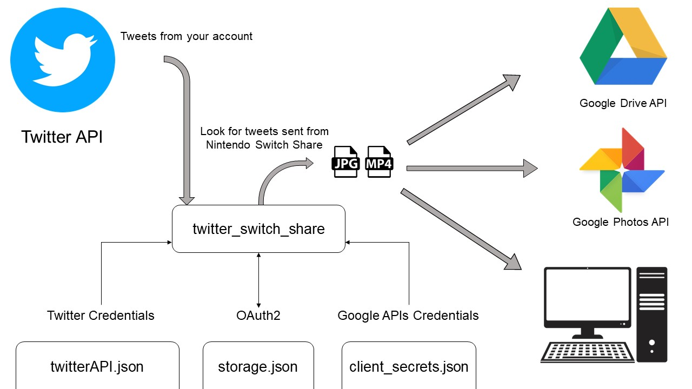

[](https://www.gnu.org/licenses/gpl-3.0)

# Twitter Switch Share
Nintendo Switch doesn't provide a method to easily share the screenshots you take from games to other devices. One way is to use a microSD card but it's a unconvenient method if the quantity is not big enough.

This script allows you to automatically download these screeshots or videos locally or upload them to Google Drive by sharing them on Twitter from your Switch.



## Getting Started
### Prerequisites
- Python 3.8
- Activate your Twitter Dev account (more info [here](https://developer.twitter.com/en/apply-for-access)) and create a Twitter App. Go to "Edit details" and then to "Keys and Tokens". Save the credentials to a JSON file and name it 'twitterAPI.json':
```JSON
{
    "consumer_key"      : "value-of-API-key",
    "consumer_secret"   : "value-of-API-secret-key",
    "access_token"      : "value-of-access-token",
    "access_secret"     : "value-of-access-token-secret" 
}
```
- Create a project in the Google APIs Console and the credentials for it (when creating the credentials, select 'Desktop application', more info [here](https://support.google.com/googleapi/answer/6158849?hl=en&ref_topic=7013279)). When it's done, download the credentials (there's a botton on the right for that) and rename them as "client_secret.json"

Once you have the APIs access, create a folder in the working directory called "creds" and move both files there.

### Installing
#### Twitter API Libraries (tweepy)
```console
> pip install tweepy
```
#### Google API Client Libraries 
```console
> pip install --upgrade google-api-python-client 

> pip install --upgrade google-auth-httplib2 

> pip install --upgrade google-auth-oauthlib

> pip install --upgrade oauth2client
```
**NOTE:** the script also uses 
- time
- json
- sys
- os
- requests
- io

since they're usually pre-installed and common use, this guide supposes you already have them installed. In case you don't:
```console
> pip install <package>
```
## Deployment
Following the guide now you have the script and a folder named "creds" in the working directory. Your local copies will be saved in a 'media' folder, which will be automatically created by the script if not found.

Open the script with a text editor and modify the constants with your preferences.

```python
HASHTAG = 'NintendoSwitch' 
USERNAME = 'your-user-name'          
LOCAL_FLAG = False  # If you want to save it locally
CLOUD_FLAG = True   # If you want to upload to Google Drive
TWEETS = 15         # Number of tweets                 
```

Save and you're good to go.

The first time you execute the script with the cloud flag activated, it will open a new tab on your browser asking for your Google account and all the permissions needed to write and search files. A new file will be created in the "creds" folder named "storage.json". For now on, it won't ask for permission since it's granted with this file.

It's trivial that "storage.json" is private and you **MUST NOT** share it since it gives access to your personal Google Drive files. 

**Keep all the credential files safe and secure from wrong hands.**

## License
This software is Open-Source under the GPL v3 license. More information [here](LICENSE).

## Acknowledgments
This project is my first Python project, so any suggestion on best practices or pull requests to improve the software is welcomed.

Finally, thanks to [Javi Marina](https://www.github.com/javmarina) for the idea of uploading the media to Google Drive, since initially the script was done to only download locally.

## TODO 

1. The script works fine on Windows. There are some compatibility issues on Linux.
2. ~~To make it more robust, it'll be better to look for tweets that were created with 'Nintendo Switch Share' instead of the hashtag, because if you delete that text it won't recognize it.~~
3. By default it takes a specific number of tweets of your account and this only translates in that number of media being uploaded only if you use an account specifically for sharing from the Nintendo Switch. I'll be looking for new methods to solve this.
